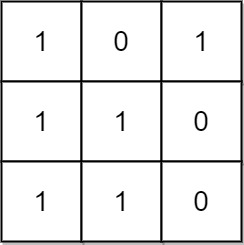
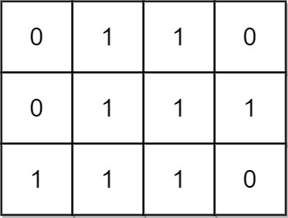

# [1504. Count Submatrices With All Ones](https://leetcode.com/problems/count-submatrices-with-all-ones/description/)

Given an `m x n` binary matrix `mat`, return the number of **submatrices** that have all ones.

## Example 1

> **Input**: mat = [[1,0,1],[1,1,0],[1,1,0]]
>
> **Output**: 13
>
> **Explanation**:
>
> There are 6 rectangles of side 1x1.
>
> There are 2 rectangles of side 1x2.
>
> There are 3 rectangles of side 2x1.
>
> There is 1 rectangle of side 2x2.
>
> There is 1 rectangle of side 3x1.
>
> Total number of rectangles = 6 + 2 + 3 + 1 + 1 = 13.

## Example 2

> **Input**: mat = [[0,1,1,0],[0,1,1,1],[1,1,1,0]]
>
> **Output**: 24
>
> **Explanation**:
>
> There are 8 rectangles of side 1x1.
>
> There are 5 rectangles of side 1x2.
>
> There are 2 rectangles of side 1x3.
>
> There are 4 rectangles of side 2x1.
>
> There are 2 rectangles of side 2x2.
>
> There are 2 rectangles of side 3x1.
>
> There is 1 rectangle of side 3x2.
>
> Total number of rectangles = 8 + 5 + 2 + 4 + 2 + 2 + 1 = 24.

## Constraints

- `1 <= m, n <= 150`
- `mat[i][j]` is either 0 or 1.
