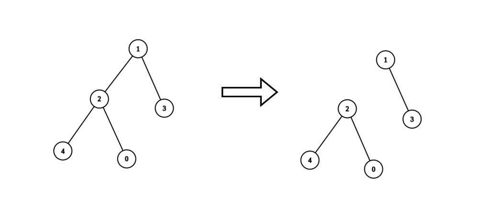
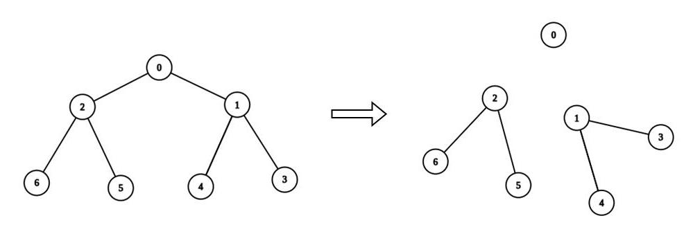

# [2872. Maximum Number of K-Divisible Components](https://leetcode.com/problems/maximum-number-of-k-divisible-components/description)

Given an undirected tree with `n` nodes (`0 … n-1`), an edge list `edges`, a value array `values`, and an integer `k`, remove any set of edges so every resulting component has a node-value sum divisible by `k`. Return the maximum number of components possible.

## Examples

**Example 1**



```
Input:  n = 5
edges  = [[0,2],[1,2],[1,3],[2,4]]
values = [1,8,1,4,4]
k      = 6
Output: 2
```

- Remove edge `1-2`.
- Component {1,3} has sum `12`; component {0,2,4} has sum `6`.

**Example 2**



```
Input:  n = 7
edges  = [[0,1],[0,2],[1,3],[1,4],[2,5],[2,6]]
values = [3,0,6,1,5,2,1]
k      = 3
Output: 3
```

- Remove edges `0-2` and `0-1`.
- Components: {0} sum `3`, {2,5,6} sum `9`, {1,3,4} sum `6`.

## Constraints

- `1 <= n <= 3 * 10^4`
- `edges.length == n - 1`
- `edges[i].length == 2`
- `0 <= ai, bi < n`
- `values.length == n`
- `0 <= values[i] <= 10^9`
- `1 <= k <= 10^9`
- Sum of all `values[i]` is divisible by `k`
- `edges` always forms a valid tree
