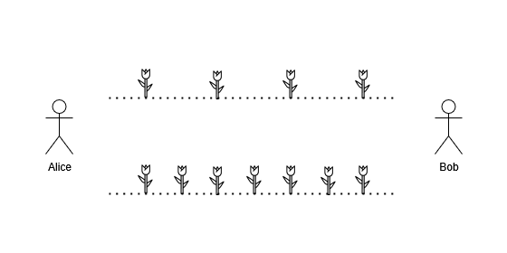

# [3021. Alice and Bob Playing Flower Game](https://leetcode.com/problems/alice-and-bob-playing-flower-game/description/)

Alice and Bob are playing a turn-based game on a field, with two lanes of flowers between them. There are `x` flowers in the first lane between Alice and Bob, and `y` flowers in the second lane between them.

The game proceeds as follows:

- Alice takes the first turn.
- In each turn, a player must choose either one of the lane and pick one flower from that side.
- At the end of the turn, if there are no flowers left at all in either lane, the **current** player captures their opponent and wins the game.

Given two integers, `n` and `m`, the task is to compute the number of possible pairs `(x, y)` that satisfy the conditions:

- Alice must win the game according to the described rules.
- The number of flowers `x` in the first lane must be in the range `[1,n]`.
- The number of flowers `y` in the second lane must be in the range `[1,m]`.

Return *the number of possible pairs `(x, y)` that satisfy the conditions mentioned in the statement*.

## Example 1

> **Input**: n = 3, m = 2
>
> **Output**: 3
>
> **Explanation**: The following pairs satisfy conditions described in the statement: (1,2), (3,2), (2,1).

## Example 2

> **Input**: n = 1, m = 1
>
> **Output**: 0
>
> **Explanation**: No pairs satisfy the conditions described in the statement.
 

## Constraints

- `1 <= n, m <= 105`