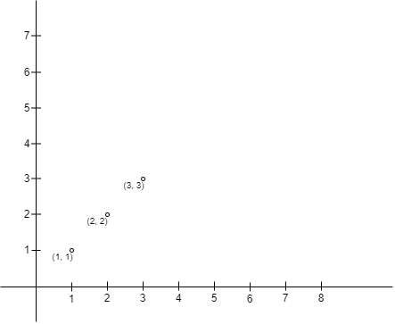

# [3025. Find the Number of Ways to Place People I](https://leetcode.com/problems/find-the-number-of-ways-to-place-people-i/description/)

You are given a 2D array `points` of size `n x 2` representing integer coordinates of some points on a 2D plane, where `points[i] = [xi, yi]`.

Count the number of pairs of points `(A, B)`, where

- `A` is on the **upper left** side of `B`, and
- there are no other points in the rectangle (or line) they make (**including the border**).
Return the count.

## Example 1

> **Input**: points = [[1,1],[2,2],[3,3]]
>
> **Output**: 0
>
> **Explanation**:
>
> 
>
> There is no way to choose A and B so A is on the upper left side of B.

## Example 2

> **Input**: points = [[6,2],[4,4],[2,6]]
>
> **Output**: 2
>
> **Explanation**:
>
>
>
> The left one is the pair (`points[1]`, `points[0]`), where points[1] is on the upper left side of `points[0]` and the rectangle is empty.
>
> The middle one is the pair (`points[2]`, `points[1]`), same as the left one it is a valid pair.
>
> The right one is the pair (`points[2]`, points[0]), where points[2] is on the upper left side of points[0], but points[1] is inside the rectangle so it's not a valid pair.

## Example 3

> **Input**: points = [[3,1],[1,3],[1,1]]
>
> **Output**: 2
>
> **Explanation**:
>
>
>
> The left one is the pair (`points[2], points[0]`), where `points[2]` is on the upper left side of `points[0]` and there are no other points on the line they form. Note that it is a valid state when the two points form a line.
>
> The middle one is the pair (`points[1]`, `points[2]`), it is a valid pair same as the left one.
>
> The right one is the pair (`points[1]`, `points[0]`), it is not a valid pair as `points[2]` is on the border of the rectangle.

## Constraints

- `2 <= n <= 50`
- `points[i].length == 2`
- `0 <= points[i][0], points[i][1] <= 50`
- All points[i] are distinct.
