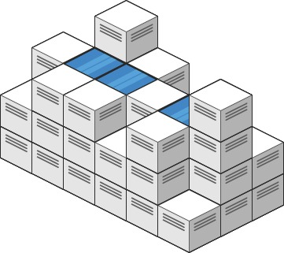
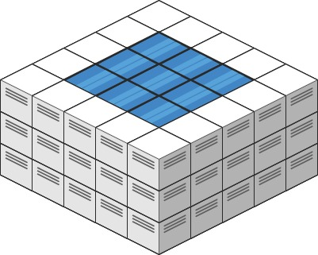

# [407. Trapping Rain Water II](https://leetcode.com/problems/trapping-rain-water-ii/description)

Given an `m x n` integer matrix `heightMap` representing the height of each unit cell in a 2D elevation map, return the volume of water it can trap after raining.

## Example 1



> **Input**: heightMap = [[1,4,3,1,3,2],[3,2,1,3,2,4],[2,3,3,2,3,1]]
>
> **Output**: 4
>
> **Explanation**: After the rain, water is trapped between the blocks.
We have two small ponds 1 and 3 units trapped.
>
> The total volume of water trapped is 4.

## Example 2



> **Input**: heightMap = [[3,3,3,3,3],[3,2,2,2,3],[3,2,1,2,3],[3,2,2,2,3],[3,3,3,3,3]]
>
> **Output**: 10

## Approach

- Treat the outer rim as the boundary of a basin and flood the grid from the outside in.
- Use a min-heap (priority queue) storing triples `(height, row, col)` so the lowest boundary is processed first.
- Track visited cells so each location is expanded once.
- Whenever we move to a neighbor that is lower than the current boundary, the difference is trapped water; the effective boundary height for that neighbor becomes `max(current height, neighbor height)`.

### Step-by-Step Flow (Example 2)

```
Initial heights (top view)
3 3 3 3 3
3 2 2 2 3
3 2 1 2 3
3 2 2 2 3
3 3 3 3 3
```

- **Step 1 – Seed boundary**: Push all rim cells (value `3`) into the heap. The water line starts at height 3 surrounding the bowl.
- **Step 2 – Expand lowest rim**: Pop the lowest boundary cell (all are `3`). Visit its neighbors. Cells with value `2` are lower, so each traps `3 - 2 = 1` unit. Push `(3, row, col)` back for each visited neighbor to maintain the raised water line.
- **Step 3 – Propagate inward**: The ring of `2`s is now treated as boundary height 3. Continue the BFS-like expansion. When the center cell `1` is visited, it traps `3 - 1 = 2` units, and the effective wall remains height 3.
- **Step 4 – Completion**: Once all cells are visited the accumulated trapped water totals `10`. The heap ensures we always expand from the safest (lowest) boundary first, mirroring how water seeps inward in reality.

## Alternative: Binary Search + BFS

- Pick a water level `L` and run a BFS from every boundary cell whose height is **below** `L`. During the search only move through cells whose height is also below `L`; these are leak paths where water could escape.
- After the BFS, any interior cell with `height < L` that was **not** visited is trapped behind higher walls, so it holds `L - height` units of water at that level.
- Binary search `L` over the range `[minHeight, maxHeight]` to find the highest level that still lets some cell leak. The search narrows to the exact level at which each enclosed basin fills.
- Accumulate the trapped water contribution at each step; because `m, n ≤ 200`, the repeated BFS runs (≈ `log maxHeight` times) finish comfortably fast.
- This formulation trades the priority queue for repeated whole-grid BFS sweeps, which can be easier to reason about when debugging with explicit water levels.
- A reference implementation of this idea lives in `trapping-rain-water-ii.go:46` as `trapRainWaterBinary`.

## Constraints

- `m == heightMap.length`
- `n == heightMap[i].length`
- `1 <= m, n <= 200`
- `0 <= heightMap[i][j] <= 2 * 10ˆ4`
