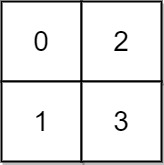
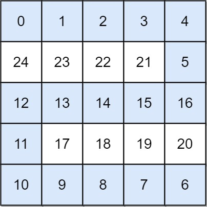

# [778. Swim in Rising Water](https://leetcode.com/problems/swim-in-rising-water/description)

You are given an `n x n` integer matrix `grid` where each value `grid[i][j]` represents the elevation at that point `(i, j)`.

It starts raining, and water gradually rises over time. At time `t`, the water level is `t`, meaning **any** cell with elevation less than equal to `t` is submerged or reachable.

You can swim from a square to another 4-directionally adjacent square if and only if the elevation of both squares individually are at most `t`. You can swim infinite distances in zero time. Of course, you must stay within the boundaries of the grid during your swim.

Return *the minimum time until you can reach the bottom right square `(n - 1, n - 1)` if you start at the top left square `(0, 0)`*.

## Example 1



> **Input**: grid = [[0,2],[1,3]]
>
> **Output**: 3
>
> **Explanation**:
>
> At time 0, you are in grid location (0, 0).
>
> You cannot go anywhere else because 4-directionally adjacent neighbors have a higher elevation than t = 0.
>
> You cannot reach point (1, 1) until time 3.
>
> When the depth of water is 3, we can swim anywhere inside the grid.

## Example 2



> **Input**: grid = [[0,1,2,3,4],[24,23,22,21,5],[12,13,14,15,16],[11,17,18,19,20],[10,9,8,7,6]]
>
> **Output**: 16
>
> **Explanation**: The final route is shown.
>
> We need to wait until time 16 so that (0, 0) and (4, 4) are connected.

## Constraints

- `n == grid.length`
- `n == grid[i].length`
- `1 <= n <= 50`
- `0 <= grid[i][j] < n2`
- Each value `grid[i][j]` is **unique**.

## Python Approaches

### Dijkstra-Style Best-First Search

We can treat each cell as a node in a graph where the cost to enter a cell is the maximum elevation encountered so far along the path. Using a min-heap, we always expand the cell with the smallest current cost, mirroring Dijkstra's algorithm. The first time we pop the bottom-right cell, we have the minimal possible maximum elevation along a valid path.

```python
from heapq import heappush, heappop


class Solution:
    def swimInWater(self, grid: list[list[int]]) -> int:
        n = len(grid)
        target = (n - 1, n - 1)
        visited = [[False] * n for _ in range(n)]
        heap = [(grid[0][0], 0, 0)]  # time, row, col

        while heap:
            time, r, c = heappop(heap)
            if (r, c) == target:
                return time
            if visited[r][c]:
                continue
            visited[r][c] = True

            for dr, dc in ((1, 0), (-1, 0), (0, 1), (0, -1)):
                nr, nc = r + dr, c + dc
                if 0 <= nr < n and 0 <= nc < n and not visited[nr][nc]:
                    next_time = max(time, grid[nr][nc])
                    heappush(heap, (next_time, nr, nc))

        return -1
```

**Complexity**: `O(n^2 log n)` time for the heap operations, `O(n^2)` space for the visited matrix and heap.

### Binary Search + BFS Feasibility Check

Because elevations range from `0` to `n^2 - 1`, we can binary-search the smallest time `t` such that a BFS traversal from `(0, 0)` reaches `(n - 1, n - 1)` using only cells with elevation `<= t`.

```python
from collections import deque


class Solution:
    def swimInWater(self, grid: list[list[int]]) -> int:
        n = len(grid)

        def can_reach(limit: int) -> bool:
            if grid[0][0] > limit:
                return False

            q = deque([(0, 0)])
            seen = [[False] * n for _ in range(n)]
            seen[0][0] = True

            while q:
                r, c = q.popleft()
                if (r, c) == (n - 1, n - 1):
                    return True
                for dr, dc in ((1, 0), (-1, 0), (0, 1), (0, -1)):
                    nr, nc = r + dr, c + dc
                    if 0 <= nr < n and 0 <= nc < n and not seen[nr][nc] and grid[nr][nc] <= limit:
                        seen[nr][nc] = True
                        q.append((nr, nc))
            return False

        lo, hi = 0, n * n - 1
        while lo < hi:
            mid = (lo + hi) // 2
            if can_reach(mid):
                hi = mid
            else:
                lo = mid + 1
        return lo
```

**Complexity**: `O(log (n^2) * n^2)` time because each BFS touches at most `n^2` cells, and `O(n^2)` space for the BFS queue and visited flags.
